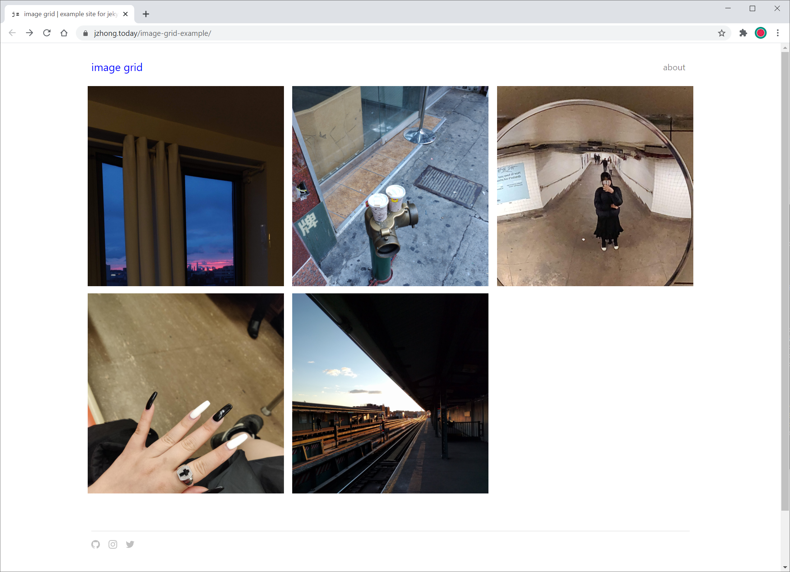

# jekyll-theme-image-grid

A simple responsive image grid theme for displaying image-based content with various built-in customization options. See a .



## Installation

[Create a new Jekyll site.](https://jekyllrb.com/docs/#instructions)

Add this line to your Jekyll site's `Gemfile`:

```ruby
gem "jekyll-theme-image-grid"
```
And then execute:

    $ bundle install

To use this theme with Github Pages, add this line to your Jekyll site's `_config.yml`:

```yaml
remote_theme: jirrian/jekyll-theme-image-grid
```

Then build your site:

    $ bundle exec jekyll serve

Preview your new site at `http://localhost:4000`.

## Adding a New Post

Posts in this theme are image based. A post must have at least one corresponding image for it to show on the home grid page.

All post markdown files are stored in the `_posts` folder.
All images are stored in folders in the `_images` folder. Post images are stored in folders `_images/yyyy-mm-dd-name-of-post` that correspond to the name of the post `yyyy-mm-dd-name-of-post.md`. For example, if your post markdown file is named `2020-12-26-hello-world.md`, it must be in the `_posts` folder. And, all images that are displayed in that post must be in a folder `2020-12-26-hello-world` that is inside the `_images` folder.

Post markdown files can contain the following:
```
---
layout: post
title: Title of Post (optional)
show_title: true (optional)
---

Post content here. (optional)
```

## Adding a Page

Pages are linked in the top nav bar. Markdown files for pages are stored in the root of the repository. Page markdown files can contain the following:
```
---
layout: page
title: About
---

Add your about me here. (optional)
```

## Display Settings

Edit settings in the `_config.yml` file to change display settings for the grid and post pages.

### Grid Page Display Settings

Choose whether to show all images from posts on home grid page or only show the first image from posts by editing the following field.
```yaml
grid_settings:
  show_all_images: true
```   
true - Displays all images in grid page.   
false - Only show first image of post in grid page. Images in a post are displayed sorted by their filename.

Choose the way images are displayed in the grid page by editing the following field.
```yaml
grid_settings:
    display: square-cropped
```   
square-cropped - Images are displayed in square grid and cropped to a square aspect ratio.   
square-og - Images are displayed in square grid and with original aspect ratios.   
masonry - Images are displayed in original aspect ratios but staggered (like Pinterest). Please note this will display the images in top to bottom (then left to right) order instead of left to right (then top to bottom).

### Post Page Display Settings

Change settings for what information is displayed on post pages.

Edit the following field to display or hide post titles on the post page. The title is from the post markdown file name or the title variable in front matter of the post markdown file.
```yaml
post_settings:
  show_title: true
```   
true - Displays title of post.
false - Does not display title of post.   
This setting can be overwritten in the frontmatter of individual post files with the show_title variable like below.
```
---
layout: post
title:
show_title: false
---
```

Edit the following field to display or hide post dates on the post page. The date is from post markdown file name.
```yaml
post_settings:
  show_date: true
```   
true - Displays date of post.   
false - Does not show date of post.

## Built-in Style Customization

The following variables can be edited in the `_sass/style.scss` file to change colors of the website's design.
```sass
$body-bg-color: white;	// background color
$header-title-color: blue;	// color of title of website
$header-bg-color: white;	// color of nav bar
$footer-color: silver;	// color of footer icons
$post-title-color: gray;	// color of post titles
$post-date-color: darkgray;	// color of post dates
$page-title-color: gray; // color of page titles 
```

For complete customization, add css to the `_sass/style.scss` file.

## License

The theme is available as open source under the terms of the [MIT License](https://opensource.org/licenses/MIT).

